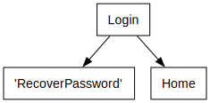

# Power App Documentation \- App\_GymTrend\_Tablet

| Property                   | Value                     |
| -------------------------- | ------------------------- |
| App Name                   | App\_GymTrend\_Tablet     |
| Documentation generated at | 17 de abril de 2024 11:22 |

- [Overview](index-App_GymTrend_Tablet.md)
- [App Details](appdetails-App_GymTrend_Tablet.md)
- [Variables](variables-App_GymTrend_Tablet.md)
- [DataSources](datasources-App_GymTrend_Tablet.md)
- [Resources](resources-App_GymTrend_Tablet.md)
- [Controls](controls-App_GymTrend_Tablet.md)

## Controls Overview

A total of 7 Screens are located in the app.

A total of 157 Controls are located in the app.

### [Screen: Gym Management](screen-Gym-Management-App_GymTrend_Tablet.md)

- [ Gym Management](screen-Gym-Management-App_GymTrend_Tablet.md)
- - [ cnt\_main\_7](screen-Gym-Management-App_GymTrend_Tablet.md)
  - - [ cnt\_body\_rec\_3](screen-Gym-Management-App_GymTrend_Tablet.md)
    - - [ Container10\_3](screen-Gym-Management-App_GymTrend_Tablet.md)
      - - [ cnt\-body\_7](screen-Gym-Management-App_GymTrend_Tablet.md)
        - - [ Gallery1](screen-Gym-Management-App_GymTrend_Tablet.md)
          - - [ Dropdown4](screen-Gym-Management-App_GymTrend_Tablet.md)
          - - [ galleryTemplate1](screen-Gym-Management-App_GymTrend_Tablet.md)
          - - [ Icon5](screen-Gym-Management-App_GymTrend_Tablet.md)
          - - [ Image7](screen-Gym-Management-App_GymTrend_Tablet.md)
          - - [ Label6](screen-Gym-Management-App_GymTrend_Tablet.md)
          - - [ Subtitle1](screen-Gym-Management-App_GymTrend_Tablet.md)
          - - [ Title1](screen-Gym-Management-App_GymTrend_Tablet.md)
          - - [ txt\_obs](screen-Gym-Management-App_GymTrend_Tablet.md)
    - - [ Container9\_3](screen-Gym-Management-App_GymTrend_Tablet.md)
      - - [ Component1\_4](screen-Gym-Management-App_GymTrend_Tablet.md)
  - - [ cnt\_footer\_7](screen-Gym-Management-App_GymTrend_Tablet.md)
    - - [ Footer\_8](screen-Gym-Management-App_GymTrend_Tablet.md)
  - - [ cnt\_header\_7](screen-Gym-Management-App_GymTrend_Tablet.md)
    - - [ Header\_8](screen-Gym-Management-App_GymTrend_Tablet.md)

### [Screen: Home](screen-Home-App_GymTrend_Tablet.md)

- [ Home](screen-Home-App_GymTrend_Tablet.md)
- - [ cnt\_main](screen-Home-App_GymTrend_Tablet.md)
  - - [ cnt\_body](screen-Home-App_GymTrend_Tablet.md)
    - - [ Container6](screen-Home-App_GymTrend_Tablet.md)
      - - [ Component1\_1](screen-Home-App_GymTrend_Tablet.md)
    - - [ Container6\_1](screen-Home-App_GymTrend_Tablet.md)
      - - [ Container7](screen-Home-App_GymTrend_Tablet.md)
        - - [ Image6](screen-Home-App_GymTrend_Tablet.md)
        - - [ Label1](screen-Home-App_GymTrend_Tablet.md)
        - - [ Label1\_2](screen-Home-App_GymTrend_Tablet.md)
  - - [ cnt\_footer](screen-Home-App_GymTrend_Tablet.md)
    - - [ Footer\_1](screen-Home-App_GymTrend_Tablet.md)
  - - [ cnt\_header](screen-Home-App_GymTrend_Tablet.md)
    - - [ Header\_1](screen-Home-App_GymTrend_Tablet.md)

### [Screen: Login](screen-Login-App_GymTrend_Tablet.md)

- [ Login](screen-Login-App_GymTrend_Tablet.md)
- - [ Button2\_1](screen-Login-App_GymTrend_Tablet.md)
- - [ Image1](screen-Login-App_GymTrend_Tablet.md)
- - [ Image2](screen-Login-App_GymTrend_Tablet.md)
- - [ Mostrar](screen-Login-App_GymTrend_Tablet.md)
- - [ msft\_Button](screen-Login-App_GymTrend_Tablet.md)
- - [ msft\_Label](screen-Login-App_GymTrend_Tablet.md)
- - [ msft\_Label\_1](screen-Login-App_GymTrend_Tablet.md)
- - [ password](screen-Login-App_GymTrend_Tablet.md)
- - [ Tac\_Icon](screen-Login-App_GymTrend_Tablet.md)
- - [ username](screen-Login-App_GymTrend_Tablet.md)
- - [ View](screen-Login-App_GymTrend_Tablet.md)

### [Screen: Recover Password](screen-Recover-Password-App_GymTrend_Tablet.md)

- [ Recover Password](screen-Recover-Password-App_GymTrend_Tablet.md)
- - [ cnt\_main\_1](screen-Recover-Password-App_GymTrend_Tablet.md)
  - - [ cnt\_body\_rec](screen-Recover-Password-App_GymTrend_Tablet.md)
    - - [ Container10](screen-Recover-Password-App_GymTrend_Tablet.md)
      - - [ cnt\-body\_1](screen-Recover-Password-App_GymTrend_Tablet.md)
        - - [ Label1\_1](screen-Recover-Password-App_GymTrend_Tablet.md)
        - - [ Label4](screen-Recover-Password-App_GymTrend_Tablet.md)
        - - [ Label5](screen-Recover-Password-App_GymTrend_Tablet.md)
        - - [ Label5\_1](screen-Recover-Password-App_GymTrend_Tablet.md)
        - - [ msft\_Button\_1](screen-Recover-Password-App_GymTrend_Tablet.md)
        - - [ password\_1](screen-Recover-Password-App_GymTrend_Tablet.md)
        - - [ password\_2](screen-Recover-Password-App_GymTrend_Tablet.md)
    - - [ Container9](screen-Recover-Password-App_GymTrend_Tablet.md)
      - - [ Component1\_2](screen-Recover-Password-App_GymTrend_Tablet.md)
  - - [ cnt\_footer\_1](screen-Recover-Password-App_GymTrend_Tablet.md)
    - - [ Footer\_2](screen-Recover-Password-App_GymTrend_Tablet.md)
  - - [ cnt\_header\_1](screen-Recover-Password-App_GymTrend_Tablet.md)
    - - [ Header\_2](screen-Recover-Password-App_GymTrend_Tablet.md)

### [Screen: Report](screen-Report-App_GymTrend_Tablet.md)

- [ Report](screen-Report-App_GymTrend_Tablet.md)
- - [ cnt\_main\_5](screen-Report-App_GymTrend_Tablet.md)
  - - [ cnt\_body\_rec\_1](screen-Report-App_GymTrend_Tablet.md)
    - - [ Container10\_1](screen-Report-App_GymTrend_Tablet.md)
      - - [ cnt\-body\_5](screen-Report-App_GymTrend_Tablet.md)
        - - [ PowerBI1](screen-Report-App_GymTrend_Tablet.md)
    - - [ Container9\_1](screen-Report-App_GymTrend_Tablet.md)
      - - [ Component1\_3](screen-Report-App_GymTrend_Tablet.md)
  - - [ cnt\_footer\_5](screen-Report-App_GymTrend_Tablet.md)
    - - [ Footer\_6](screen-Report-App_GymTrend_Tablet.md)
  - - [ cnt\_header\_5](screen-Report-App_GymTrend_Tablet.md)
    - - [ Header\_6](screen-Report-App_GymTrend_Tablet.md)

### [Screen: Screen1](screen-Screen1-App_GymTrend_Tablet.md)

- [ Screen1](screen-Screen1-App_GymTrend_Tablet.md)
- - [ Camera1](screen-Screen1-App_GymTrend_Tablet.md)
- - [ Gallery2](screen-Screen1-App_GymTrend_Tablet.md)
  - - [ galleryTemplate2](screen-Screen1-App_GymTrend_Tablet.md)
  - - [ Icon4](screen-Screen1-App_GymTrend_Tablet.md)
  - - [ Image3](screen-Screen1-App_GymTrend_Tablet.md)
- - [ Icon3](screen-Screen1-App_GymTrend_Tablet.md)

### [Screen: User Management](screen-User-Management-App_GymTrend_Tablet.md)

- [ User Management](screen-User-Management-App_GymTrend_Tablet.md)
- - [ cnt\_main\_8](screen-User-Management-App_GymTrend_Tablet.md)
  - - [ cnt\_body\_rec\_4](screen-User-Management-App_GymTrend_Tablet.md)
    - - [ Container1](screen-User-Management-App_GymTrend_Tablet.md)
      - - [ ScreenContainer1](screen-User-Management-App_GymTrend_Tablet.md)
        - - [ BodyContainer1](screen-User-Management-App_GymTrend_Tablet.md)
          - - [ DeleteConfirmDialogContainer1](screen-User-Management-App_GymTrend_Tablet.md)
            - - [ ConfirmDeleteButtonBarContainer1](screen-User-Management-App_GymTrend_Tablet.md)
              - - [ CancelDeleteButton1](screen-User-Management-App_GymTrend_Tablet.md)
              - - [ ConfirmDeleteButton1](screen-User-Management-App_GymTrend_Tablet.md)
            - - [ ConfirmDeletionLabel1](screen-User-Management-App_GymTrend_Tablet.md)
          - - [ RightContainer1](screen-User-Management-App_GymTrend_Tablet.md)
            - - [ MainContainer1](screen-User-Management-App_GymTrend_Tablet.md)
              - - [ Form1](screen-User-Management-App_GymTrend_Tablet.md)
                - - [ Passwords\_DataCard1](screen-User-Management-App_GymTrend_Tablet.md)
                  - - [ DataCardKey3](screen-User-Management-App_GymTrend_Tablet.md)
                  - - [ DataCardValue3](screen-User-Management-App_GymTrend_Tablet.md)
                  - - [ ErrorMessage3](screen-User-Management-App_GymTrend_Tablet.md)
                  - - [ StarVisible3](screen-User-Management-App_GymTrend_Tablet.md)
                - - [ User\_Type\_DataCard1](screen-User-Management-App_GymTrend_Tablet.md)
                  - - [ DataCardKey4](screen-User-Management-App_GymTrend_Tablet.md)
                  - - [ DataCardValue4](screen-User-Management-App_GymTrend_Tablet.md)
                  - - [ ErrorMessage4](screen-User-Management-App_GymTrend_Tablet.md)
                  - - [ StarVisible4](screen-User-Management-App_GymTrend_Tablet.md)
                - - [ Username\_DataCard1](screen-User-Management-App_GymTrend_Tablet.md)
                  - - [ DataCardKey2](screen-User-Management-App_GymTrend_Tablet.md)
                  - - [ DataCardValue2](screen-User-Management-App_GymTrend_Tablet.md)
                  - - [ ErrorMessage2](screen-User-Management-App_GymTrend_Tablet.md)
                  - - [ StarVisible2](screen-User-Management-App_GymTrend_Tablet.md)
              - - [ Form1\_1](screen-User-Management-App_GymTrend_Tablet.md)
                - - [ Imagem\_DataCard1\_1](screen-User-Management-App_GymTrend_Tablet.md)
                  - - [ AddPicture1\_1](screen-User-Management-App_GymTrend_Tablet.md)
                  - - [ DataCardKey5\_1](screen-User-Management-App_GymTrend_Tablet.md)
                  - - [ ErrorMessage5\_1](screen-User-Management-App_GymTrend_Tablet.md)
                  - - [ Image5\_1](screen-User-Management-App_GymTrend_Tablet.md)
                  - - [ StarVisible5\_1](screen-User-Management-App_GymTrend_Tablet.md)
                - - [ Name\_DataCard1\_1](screen-User-Management-App_GymTrend_Tablet.md)
                  - - [ DataCardKey1\_1](screen-User-Management-App_GymTrend_Tablet.md)
                  - - [ DataCardValue1\_1](screen-User-Management-App_GymTrend_Tablet.md)
                  - - [ ErrorMessage1\_1](screen-User-Management-App_GymTrend_Tablet.md)
                  - - [ StarVisible1\_1](screen-User-Management-App_GymTrend_Tablet.md)
            - - [ SelectedRecordHeaderContainer1](screen-User-Management-App_GymTrend_Tablet.md)
              - - [ BackIconButton1](screen-User-Management-App_GymTrend_Tablet.md)
              - - [ DeleteIconButton1](screen-User-Management-App_GymTrend_Tablet.md)
              - - [ EditIconButton1](screen-User-Management-App_GymTrend_Tablet.md)
              - - [ ResetFormButton1](screen-User-Management-App_GymTrend_Tablet.md)
              - - [ SelectedRecordTitle1](screen-User-Management-App_GymTrend_Tablet.md)
              - - [ SubmitFormButton1](screen-User-Management-App_GymTrend_Tablet.md)
          - - [ SidebarContainer1](screen-User-Management-App_GymTrend_Tablet.md)
            - - [ NewRecordButtonBarContainer1](screen-User-Management-App_GymTrend_Tablet.md)
              - - [ NewRecordAddIcon1](screen-User-Management-App_GymTrend_Tablet.md)
              - - [ NewRecordLabel1](screen-User-Management-App_GymTrend_Tablet.md)
            - - [ RecordsGallery1](screen-User-Management-App_GymTrend_Tablet.md)
              - - [ Body1](screen-User-Management-App_GymTrend_Tablet.md)
              - - [ galleryTemplate1\_1](screen-User-Management-App_GymTrend_Tablet.md)
              - - [ NextArrow1](screen-User-Management-App_GymTrend_Tablet.md)
              - - [ Rectangle1](screen-User-Management-App_GymTrend_Tablet.md)
              - - [ Separator1](screen-User-Management-App_GymTrend_Tablet.md)
              - - [ Subtitle1\_1](screen-User-Management-App_GymTrend_Tablet.md)
              - - [ Title1\_1](screen-User-Management-App_GymTrend_Tablet.md)
            - - [ RecordsListSeparator1](screen-User-Management-App_GymTrend_Tablet.md)
            - - [ SearchContainer1](screen-User-Management-App_GymTrend_Tablet.md)
              - - [ SearchIcon1](screen-User-Management-App_GymTrend_Tablet.md)
              - - [ SearchInput1](screen-User-Management-App_GymTrend_Tablet.md)
        - - [ TableNameContainer1](screen-User-Management-App_GymTrend_Tablet.md)
          - - [ TableNameLabel1](screen-User-Management-App_GymTrend_Tablet.md)
    - - [ Container9\_4](screen-User-Management-App_GymTrend_Tablet.md)
      - - [ Component1\_6](screen-User-Management-App_GymTrend_Tablet.md)
  - - [ cnt\_footer\_8](screen-User-Management-App_GymTrend_Tablet.md)
    - - [ Footer\_9](screen-User-Management-App_GymTrend_Tablet.md)
  - - [ cnt\_header\_8](screen-User-Management-App_GymTrend_Tablet.md)
    - - [ Header\_9](screen-User-Management-App_GymTrend_Tablet.md)

## Screen Navigation

The following diagram shows the navigation between the different screens.

